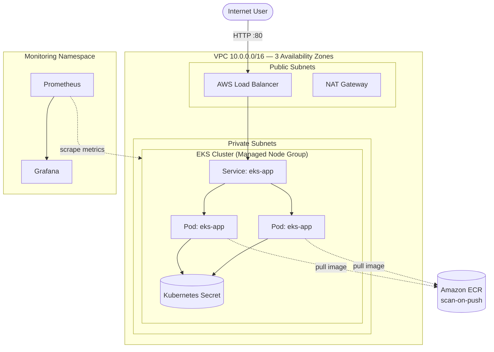

# 🚀 eks-app-platform

<p align="center">
  
  
  
  
  
</p>

---

## 🧠 Overview

A production-style application platform deployed on **Amazon EKS**, provisioned entirely with **Terraform**.

This project builds a complete cloud-native system: infrastructure, containerized application, deployment pipeline, and observability stack — all reproducible from code.

> Designed as a hands-on demonstration of real-world DevOps, Kubernetes engineering, and AWS cloud architecture.

---

## 🏗️ Architecture



---

## ⚙️ What this project demonstrates

### 🧱 Infrastructure as Code
- Entire AWS environment defined in **Terraform**
- VPC, subnets, NAT gateway, IAM roles, EKS cluster, and node groups
- Fully reproducible infrastructure with zero console setup

### ☸️ Kubernetes orchestration
- EKS-managed Kubernetes cluster
- Deployments, Services, Secrets, and health probes
- Self-healing pods and scalable replicas

### 🔐 Security hardening
- KMS-encrypted secrets
- Non-root container execution
- Read-only filesystem + dropped Linux capabilities
- IMDSv2 enforced on nodes
- ECR image scanning enabled

### 📊 Observability
- Prometheus scraping cluster + workload metrics
- Grafana dashboards for visualization
- Monitoring deployed via Helm (`kube-prometheus-stack`)

### 💰 Cost-aware design
- Single NAT gateway (reduced cost)
- Minimal managed node group
- Easy teardown via Terraform

---

## 🧪 Chaos Engineering Test (Self-Healing Demo)

To validate Kubernetes resilience, a controlled chaos test was performed:

### 🔬 Test Scenario
- Application deployed with 2 replicas
- Kubernetes Deployment managing pod lifecycle
- Service exposing pods behind AWS Load Balancer

### 💥 Fault Injection
A running pod was deliberately terminated:

```bash
kubectl delete pod <pod-name> -n demo
```

### 🔁 Expected Behavior
- Kubernetes detects missing replica
- Deployment controller automatically recreates pod
- Service continues routing traffic with no downtime

### ✅ Result
- Pod successfully recreated within seconds
- No service interruption observed
- Demonstrates Kubernetes self-healing capabilities

---

## 📊 Observability (Grafana Evidence)

System behavior was validated using **Prometheus + Grafana** dashboards.

- 📈 Screenshot 1: Extended monitoring session (system stability over time)
- ⚡ Screenshot 2: 5-second snapshot showing rapid recovery after pod termination

> These visuals confirm real-time cluster resilience, scaling behavior, and health recovery under failure conditions.

*(Screenshots included in repository under `/images` or attached in README assets)*

---

## 🧰 Tech Stack

| Layer | Tools |
|------|------|
| Infrastructure as Code | Terraform (AWS modules for VPC & EKS) |
| Cloud | AWS (EKS, EC2, VPC, IAM, ECR, KMS, ELB) |
| Containers | Docker, Amazon ECR |
| Orchestration | Kubernetes (EKS), kubectl |
| Application | Python, FastAPI, Uvicorn |
| Observability | Prometheus, Grafana (Helm) |

---

## 🔄 Workflow

1. Terraform provisions full AWS infrastructure
2. EKS cluster is created with managed node groups
3. Docker image is built and pushed to ECR
4. Kubernetes deploys the application
5. Prometheus scrapes metrics from cluster
6. Grafana visualizes system health and performance

---

## 🧹 Cleanup

To destroy all resources:

```bash
terraform destroy
```

---

## 📌 Notes

This project mirrors real-world production patterns used in modern DevOps and platform engineering teams, focusing on automation, scalability, and observability.

## Problems I Faced

Real issues hit while building this — and how I diagnosed and resolved each.

### 1. ☸️ Pods stuck in `CreateContainerConfigError`
- **Symptom:** After deploying, both pods failed with `CreateContainerConfigError` and never started.
- **Diagnosis:** The pod events (`kubectl describe pod`) showed: *"container has runAsNonRoot and image has non-numeric user (appuser), cannot verify user is non-root."* My security context set `runAsNonRoot: true`, but the image's `USER appuser` is a **name** — Kubernetes can only verify a user is non-root from a numeric UID, not a username.
- **Fix:** Pinned the numeric UID in the pod security context (`runAsUser: 1000`, `runAsGroup: 1000`, `fsGroup: 1000`). Pods rolled out cleanly via a zero-downtime rolling update.
- **Lesson:** `runAsNonRoot` needs a numeric UID — a named user baked into the image isn't enough for the kubelet to enforce it.

### 2. 🔐 Accidentally exposed an AWS access key
- **Symptom:** While configuring the CLI, an AWS access key + secret were exposed in plaintext.
- **Diagnosis:** Once a credential leaves its private environment it must be treated as compromised.
- **Fix:** Immediately deactivated and deleted the key, created a new IAM user/key, and reconfigured — then moved toward injecting credentials as environment variables instead of typing them where they can be copied.
- **Lesson:** Never expose secrets outside the environment they live in, and rotate immediately if one leaks. Credentials belong in a terminal or secret store — never in logs, output, or commits.

### 3. 💥 `terraform destroy` hanging on orphaned load balancers
- **Symptom:** During teardown, Terraform stalled trying to delete the VPC.
- **Diagnosis:** The `Service type: LoadBalancer` provisioned an AWS ELB **outside** Terraform's state. Terraform can't delete a VPC while that load balancer still holds network interfaces inside it.
- **Fix:** Remove the Kubernetes resources first so AWS deletes the load balancer, then destroy:
  \`\`\`bash
  kubectl delete -f k8s/ ; kubectl delete namespace monitoring
  terraform destroy
  \`\`\`
- **Lesson:** Resources created *by* Kubernetes (not Terraform) must be torn down before Terraform can remove what they depend on.

### 4. 🔧 `git push` blocked by a Git LFS hook
- **Symptom:** `git push` failed with a Git LFS hook error, even though the commit succeeded.
- **Diagnosis:** The environment had Git LFS hooks configured but `git-lfs` wasn't installed, so the pre-push hook aborted the push.
- **Fix:** Installed Git LFS (`sudo apt-get install -y git-lfs && git lfs install`) and re-pushed.
- **Lesson:** Git hooks can block a push for reasons unrelated to your code — read the actual hook error, not just "push failed."
