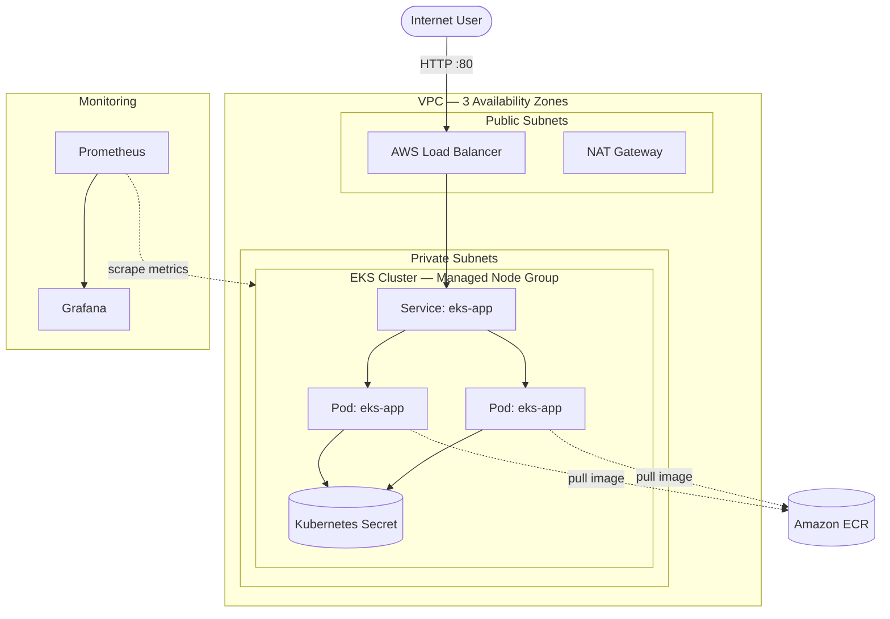

# 🚀 EKS Application Platform

<p align="center">
  
  
  
  
  
</p>

---

## 🧠 Overview

A production-inspired cloud platform demonstrating how I would provision, deploy, secure, and observe a containerized application on AWS EKS.

The application itself is intentionally simple. The platform is the main focus: infrastructure as code, Kubernetes orchestration, workload security, health checks, self-healing, and observability.

Everything required for the AWS foundation is defined in Terraform, with Kubernetes manifests defining the application workload.

---

## 🏗️ Architecture



Terraform provisions the AWS foundation: VPC, public/private subnets, NAT gateway, EKS cluster, managed node group, and ECR.

EKS worker nodes run in private subnets across three Availability Zones. Kubernetes exposes the application through a Service, while Prometheus and Grafana provide workload and cluster observability.

---

## ⚙️ What this project demonstrates

### 🧱 Infrastructure as Code
- Terraform-managed AWS infrastructure
- VPC with public and private subnets across three Availability Zones
- EKS cluster and managed node group
- ECR container registry
- IAM and KMS-backed AWS resources
- Reproducible infrastructure without manual console configuration

### ☸️ Kubernetes
- Amazon EKS
- Deployments and replica management
- Kubernetes Services and Namespaces
- Kubernetes Secret references
- Liveness and readiness probes
- CPU and memory requests/limits
- Self-healing through replica reconciliation

### 🔐 Workload security
- Non-root container execution
- Explicit numeric UID/GID
- Read-only root filesystem
- Dropped Linux capabilities
- Disabled privilege escalation
- RuntimeDefault seccomp profile

### 📊 Observability
- Prometheus metrics collection
- Grafana dashboards
- Kubernetes workload monitoring
- Helm-based monitoring stack

### 💰 Cost-aware design
- Single NAT gateway to reduce development cost
- Minimal managed node group
- Terraform-based teardown

---

## 🧪 Chaos Engineering Test — Kubernetes Self-Healing

The application runs with two replicas. To validate Kubernetes reconciliation, a running pod was deliberately terminated:

```bash
kubectl delete pod <pod-name> -n demo
```

Kubernetes detected the missing replica and recreated the pod. The Service continued routing traffic to the available replica.

**Observed result:** the replacement pod came back within seconds and no service interruption was observed during the test.

This demonstrates the practical behavior of a Kubernetes Deployment maintaining its desired state.

---

## 📊 Observability

Prometheus and Grafana were used to inspect cluster and workload behavior during testing.

The repository includes Grafana screenshots showing both an extended monitoring window and a short-duration view of system behavior.

---

## 🧰 Tech Stack

| Layer | Tools |
|------|------|
| Infrastructure as Code | Terraform (AWS VPC & EKS modules) |
| Cloud | AWS EKS, EC2, VPC, IAM, ECR, KMS, ELB |
| Containers | Docker, Amazon ECR |
| Orchestration | Kubernetes, Amazon EKS, kubectl |
| Application | Python, FastAPI, Uvicorn |
| Observability | Prometheus, Grafana, Helm |

---

## 🔄 Workflow

```text
Terraform
   ↓
AWS VPC + EKS + ECR
   ↓
Build container image
   ↓
Push image to ECR
   ↓
Deploy Kubernetes workload
   ↓
Service routes traffic to replicas
   ↓
Prometheus collects metrics
   ↓
Grafana visualizes health and performance
```

---

## 🔐 Secret handling

The application Deployment references a Kubernetes Secret named `eks-app-secret`. The secret value is intentionally **not stored in this repository**.

Create the secret in the cluster before deploying the workload:

```bash
kubectl create secret generic eks-app-secret \
  --namespace demo \
  --from-literal=greeting='Hello from EKS'
```

For production workloads, secrets should be managed through an appropriate secrets-management solution rather than committed to Git.

---

## 🚀 Getting Started

### 1. Provision the AWS infrastructure

```bash
cd terraform
terraform init
terraform plan
terraform apply
```

### 2. Configure kubectl for the EKS cluster

Use the cluster name and AWS region defined by the Terraform configuration to configure your local kubeconfig.

### 3. Create the application namespace and secret

```bash
kubectl apply -f k8s/namespace.yaml
kubectl create secret generic eks-app-secret \
  --namespace demo \
  --from-literal=greeting='Hello from EKS'
```

### 4. Deploy the workload

```bash
kubectl apply -f k8s/deployment.yaml
kubectl apply -f k8s/service.yaml
```

### 5. Verify

```bash
kubectl get pods -n demo
kubectl get svc -n demo
kubectl describe deployment eks-app -n demo
```

### 6. Clean up

Remove Kubernetes resources first so AWS resources created by Kubernetes can be released cleanly:

```bash
kubectl delete -f k8s/service.yaml
kubectl delete -f k8s/deployment.yaml
kubectl delete -f k8s/namespace.yaml
```

Then destroy the Terraform-managed infrastructure:

```bash
cd terraform
terraform destroy
```

---

## 🧠 Problems I Faced & What I Learned

### 1. ☸️ Pods stuck in `CreateContainerConfigError`

The initial deployment used `runAsNonRoot: true` while the image specified a named user. Kubernetes could not verify that the named user was non-root.

**Fix:** pinned an explicit numeric UID/GID (`1000`) in the Kubernetes security context.

**Lesson:** security controls need to be compatible with how the container image defines its runtime user.

### 2. 🔐 AWS credential exposure

During development, an AWS access key and secret were exposed in plaintext.

**Fix:** the credential was immediately deactivated and deleted, then replaced with a new credential.

**Lesson:** exposed credentials should be treated as compromised and rotated immediately. Credentials should never be committed to source control.

### 3. 💥 `terraform destroy` hanging on load balancer resources

The Kubernetes `LoadBalancer` Service created AWS resources outside Terraform's state. During teardown, those resources could prevent the underlying VPC from being destroyed.

**Fix:** remove the Kubernetes workloads first, allow their AWS resources to be released, then run `terraform destroy`.

**Lesson:** when multiple systems manage resources in the same environment, understand their ownership and dependency order during teardown.

### 4. 🔧 Git push blocked by a Git LFS hook

A Git push was blocked because Git LFS hooks were configured but Git LFS was not installed in the environment.

**Fix:** installed Git LFS and re-ran the push.

**Lesson:** read the underlying hook error when a Git operation fails instead of assuming the application code is responsible.

---

## 📌 Why I built this

I built this project to strengthen practical platform engineering skills around AWS, Kubernetes, infrastructure as code, security, observability, and operational troubleshooting.

The goal was not simply to deploy an application. It was to understand the platform underneath it: how infrastructure is provisioned, how workloads are exposed, how Kubernetes responds to failure, and how engineers can observe and troubleshoot the system.
